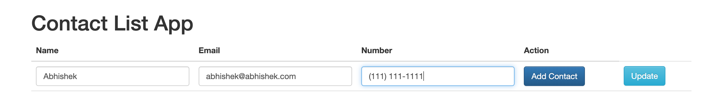
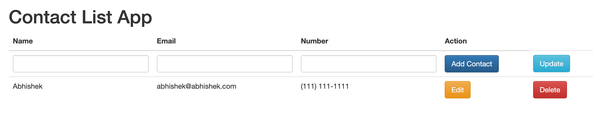
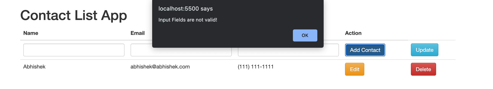

# Contact List App

## Overview 
This Contact List App is a web application that allows you to manage a list of contacts. You can add, edit, delete, and view contacts through a user-friendly interface. It also validates the contacts before creating/updating them.

## Features
- Validates that the name starts with an uppercase letter
- Validates that the number is of form "(xxx) xxx - xxxx"
- Displays error messages dynamically if validation fails

## Getting Started

To run this project locally, follow these steps:

1. Clone the repository to your local machine:
   - `git clone https://github.com/your-username/contact-list-app.git`

2. Navigate to the project directory:
   - `cd contact-list-app`

3. Install the project dependencies using npm:
   - `npm install`

4. Start the server using nodemon (assuming you have nodemon installed globally):
   - `nodemon server.js`
   
   If you don't have nodemon installed globally, you can install it locally:
   - `npm install nodemon --save-dev`
   
   Then, start the server with:
   - `npx nodemon server.js`

5. Open your web browser and go to:
   - `http://localhost:5500`

## Usage

- **Add a Contact**: Fill in the name, email, and phone number fields and click the "Add Contact" button.

- **Edit a Contact**: Click the "Edit" button next to a contact to modify its details. After making changes, click the "Update" button.

- **Delete a Contact**: Click the "Delete" button next to a contact to remove it from the list.

## Contributing

If you would like to contribute to this project or report issues, please follow these steps:

1. Fork the repository on GitHub.

2. Clone your forked repository to your local machine.

3. Create a new branch for your feature or bug fix.

4. Make your changes and commit them with descriptive commit messages.

5. Push your changes to your GitHub repository.

6. Create a pull request from your branch to the main repository.

7. Describe your changes and provide any necessary context in the pull request.
